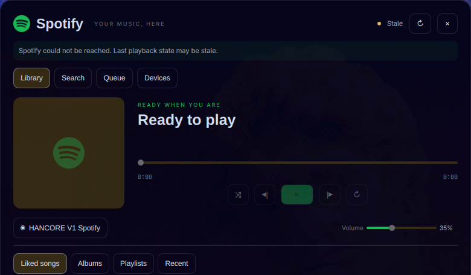

# Oma Spotify

Oma Spotify adds a compact Spotify control to the Omarchy top bar. Its popup covers playback, seek, volume, library browsing, search, queue additions, and Spotify Connect devices. Local playback through spotifyd is optional.

The plugin starts blank. Each installer supplies their own Spotify Developer Client ID and logs in with OAuth PKCE. Do not create, paste, store, or commit a client secret. The backend rejects unexpected configuration keys, including `client_secret`. The Client ID field is public data: format checks cannot distinguish a 32-hex Client ID from a 32-hex client secret.

## Screenshots


*Compact now-playing widget. Captured from the running HANCORE V1 interface used as the extraction source.*



*Expanded library and playback view. Captured from the same live source UI, not a mock. The old `HANCORE V1 Spotify` device label belongs to that source capture; installed Oma Spotify instances use `Oma Spotify`. No token or Client ID appears in either image.*

## Prerequisites

- Omarchy with the `omarchy plugin` commands
- Python 3
- `secret-tool`, supplied by the `libsecret` package, and an unlocked Secret Service keyring
- `xdg-open` and a browser for login
- A Spotify account. Spotify requires Premium for the playback-control endpoints used here.
- Node.js and Qt 6 `qmltestrunner` only when running the checks
- spotifyd only if this computer should be a local Spotify Connect playback device

## Create the Spotify app

1. Open the [Spotify Developer Dashboard](https://developer.spotify.com/dashboard).
2. Create an app.
3. Add this redirect URI exactly:

   ```text
   http://127.0.0.1:8888/callback
   ```

4. Save the app settings.
5. Copy the 32-character Client ID only.

Do not copy the client secret. Oma Spotify uses no client-secret authentication and has no secret configuration field. Anything pasted into the Client ID field is treated and stored as public data, not protected as an OAuth credential.

## Install

Replace the placeholder with the repository's published Git URL:

```bash
omarchy plugin add https://github.com/YOUR-USER/Oma-Spotify.git --enable
```

The manifest ID is `blazeluminati.oma-spotify`. The plugin declares one shared service and one bar widget. Its default section is the center. To enable or move it explicitly:

```bash
omarchy plugin enable blazeluminati.oma-spotify --section center
omarchy bar move blazeluminati.oma-spotify --section right
```

Omarchy loads the service and widget from the installed checkout. The plugin has no dependency on HANCORE V1.

## First login

1. Click the Spotify widget.
2. Paste the 32-character Client ID and choose **Save Client ID**.
3. Choose **Connect Spotify**.
4. Complete Spotify login in the browser within three minutes. The loopback listener accepts one callback on `127.0.0.1:8888`, then closes. Invalid or incomplete callbacks end that attempt; start login again.
5. Return to the popup and refresh if playback state has not appeared yet.

If you saved an incorrect ID, replace it in the unauthenticated setup view and choose **Save Client ID**, then **Connect Spotify**. Editing and saving remain available after setup, but are disabled while work is in progress. If you accidentally pasted a client secret, replace it with the Client ID and rotate the exposed secret in the Developer Dashboard.

The requested OAuth scopes cover playback state and controls, profile state, library reads and writes, private and collaborative playlists, and recent playback. Spotify shows the final scope list during login.

## Optional local playback with spotifyd

Oma Spotify can control any available Spotify Connect device without spotifyd. For local audio, install spotifyd and configure it through its own documentation. You can set its displayed device name to `Oma Spotify`; authenticate it, then start the user service:

```bash
spotifyd authenticate
systemctl --user enable --now spotifyd.service
systemctl --user status spotifyd.service
```

The plugin does not start spotifyd. All controls use the Web API and an explicit Connect device ID, including local playback. MPRIS does not provide a verifiable association with that ID, so the plugin does not use a name-based local fast path or label same-name devices as “This computer.” Remote controls remain available when spotifyd is stopped.

## Controls

The bar shows the current title plus play or pause and next controls. Open the popup for:

- play, pause, previous, next, shuffle, repeat, seek, and volume
- liked tracks, saved albums, playlists, and recent playback
- track, album, artist, and playlist search
- queue viewing and append-only queue additions
- Spotify Connect device selection
- saving tracks or albums to the library

Seek and volume commit after pointer release or keyboard movement, without sending programmatic updates or duplicate release requests. Open popups on different monitors share authentication, playback, devices, and the serialized process queue, but keep independent library/search views, results, and pagination. Closing or destroying one cancels only its list work; late responses cannot replace another popup's results.

Library, search, context browsing, saving, and queue viewing remain available after authentication without a playback device. Only playback-dependent actions (including queue additions) require an available Connect device; use **Devices** to select one. Spotify may still return an empty queue or a no-device error for queue reads.

Spotify does not expose queue clear or reorder through the API used by this plugin.

## Security and storage

OAuth uses RFC 7636 PKCE with an S256 challenge. The redirect is fixed to `http://127.0.0.1:8888/callback`. The callback handler requires the exact loopback Host header, callback path, matching state, and one non-empty authorization code. It rejects duplicate Host headers, suppresses request logging, and sends fixed browser messages. Failed callback response writes never authorize a code exchange. A callback connection has a five-second absolute budget, including slow-drip input. Concurrent login attempts reject immediately; credential locks wait at most two seconds.

The helper accepts only fixed Spotify HTTPS endpoints and validated relative API paths. It validates action values and Spotify URIs, caps responses at 4 MiB, blocks redirects, persists Spotify rate-limit deadlines (including refresh failures), never retries mutations, and replaces upstream error bodies with fixed messages. Only definitive authorization failures persist a login-required marker; network, keyring, and rate-limit failures preserve authentication.

Each helper invocation has a 45-second absolute deadline (210 seconds for login). An independent QML watchdog requests termination after 50 seconds (215 for login), discards queued actions, marks state stale and suspends automatic work even if the active list was cancelled. It ignores late output and escalates to SIGKILL after a two-second cleanup grace period. Service destruction also requests termination. The helper kills owned subprocess groups and gives each direct child at most one second to be reaped when interrupted; the deliberately detached OAuth browser is never killed by this cleanup. A timed-out mutation may already have succeeded: refresh before trying another action. These helper deadlines use Linux main-thread signals. Cleanup cannot be guaranteed after an external SIGKILL, a shell crash that bypasses destruction, or uninterruptible kernel I/O; descendants that deliberately leave an owned process group are outside its cleanup boundary.

QML validates complete helper envelopes and the state fields it consumes before applying any result. Malformed responses preserve stale playback and suspend automatic work. External titles, artists, albums, device names, and messages render as plain text, never interpreted markup; host-owned tooltips use fixed text.

Public setup data lives at `${XDG_CONFIG_HOME:-$HOME/.config}/oma-spotify/config.json` with mode `0600`. That file contains only the Client ID, exact redirect URI, and local device name. OAuth access and refresh tokens go to Secret Service through `secret-tool`; the helper sends them on standard input, never in process arguments or QML output. Non-secret lock, login-required, and rate-limit files live under `${XDG_STATE_HOME:-$HOME/.local/state}/oma-spotify`.

Do not add a config file, token, or secret to this repository.

## Remove

Disable and remove the plugin checkout:

```bash
omarchy plugin disable blazeluminati.oma-spotify
omarchy plugin remove blazeluminati.oma-spotify
```

Omarchy removal does not remove application data. To erase the saved token and public setup data too:

```bash
secret-tool clear application blazeluminati.oma-spotify client-id YOUR_32_CHARACTER_CLIENT_ID
rm -rf "${XDG_CONFIG_HOME:-$HOME/.config}/oma-spotify"
rm -rf "${XDG_STATE_HOME:-$HOME/.local/state}/oma-spotify"
```

Run the `secret-tool clear` command before deleting the config if you need to read the Client ID from it. Never paste a client secret into that command.

## Troubleshooting

- **Client ID rejected or login rejects a saved ID:** copy the Client ID, not the secret. It must contain exactly 32 hexadecimal characters, but that format does not prove it is an ID. While unauthenticated, replace it and choose **Save Client ID** before reconnecting. Rotate any secret accidentally pasted into this public field.
- **Callback rejected:** the dashboard redirect must be exactly `http://127.0.0.1:8888/callback`. `localhost` is not accepted.
- **Login cannot start:** check that a browser is available and port 8888 is free: `ss -ltn 'sport = :8888'`.
- **Keyring error:** unlock the desktop keyring and confirm `secret-tool` is installed.
- **No playback device:** open Spotify on another Connect device, or start authenticated spotifyd, then refresh the Devices tab.
- **Local audio unavailable:** confirm `systemctl --user status spotifyd.service` and spotifyd authentication, then choose its device in Spotify Connect. MPRIS and a particular device name are not required.
- **Stale state:** refresh manually after restoring network access. For HTTP 429 responses, wait for the displayed rate-limit period instead of retrying.
- **Playback action denied:** check Spotify Premium, app access, and device restrictions.

## Checks

Run these from the repository root. They use no credentials and make no live Spotify requests:

```bash
mkdir -p build/test-tmp
export TMPDIR="$PWD/build/test-tmp"
python3 -m unittest discover -s tests -p 'test_spotifyctl.py'
python3 -m unittest discover -s tests -p 'test_deadlines.py'
python3 -m unittest discover -s tests -p 'test_qml_safety.py'
python3 -m unittest discover -s tests -p 'test_scan_secrets.py'
node tests/test_state.cjs
node tests/test_review_state.cjs
python3 tests/test_search_style.py
python3 tests/test_qml_controls.py
omarchy plugin validate .
git diff --check
python3 tests/scan_secrets.py
git status --short
```

Use the four exact unittest patterns above: they select only unittest modules. `test_search_style.py` and `test_qml_controls.py` are standalone Qt runners and must each be run explicitly; wildcard unittest discovery is not a complete check, even though imports are now side-effect-free. Both Qt runners use disposable runtime/cache directories under `TMPDIR` and remove them on exit (including fontconfig symlinks that plugin validation rejects). Before committing, stage the reviewed changes and repeat `git diff --cached --check` and `python3 tests/scan_secrets.py` so the index scan covers the proposed commit, including new tests.

The Python tests cover callback, lock/deadline, real owned-child termination/reaping and detached-browser survival, config, endpoint, input, Secret Service process-boundary, refresh-failure, safe-error behavior, and duplicate-blob path authorization in disposable Git repositories. Callback tests use isolated ephemeral loopback sockets, not Spotify. Node executes the real state module and service functions. Qt runs the real panel and extracts the search, plain-text action label, slider, popup-owner, and service code with the offscreen Basic style and a fake process launcher. Two-popup regressions cover Library/Search results, Enter actions, pagination, and closing or destroying either owner; host integration is not exercised. The QML safety unittest also checks every plugin-owned Text node and the host label boundary. `omarchy plugin validate .` checks the manifest and entry-point paths, not live shell behavior. Qt also covers saved-ID correction and busy guards, device-independent browsing, escaped helper source paths and literal arguments, and control-level search-option accessible names. The redacted secret scan checks every index and reachable commit-tree path independently for Client ID/token literals and runtime files, allowing named synthetic fixtures only under their own test paths. Content inspection is deduplicated, path authorization is not; this is not OCR or arbitrary-encoding detection.

## License and Spotify mark

The extracted code is available under the [MIT License](LICENSE). The Spotify SVG attribution and CC0 source details are in [assets/spotify-LICENSE.txt](assets/spotify-LICENSE.txt). Spotify and its logo are trademarks of Spotify AB. Their use identifies the service and does not imply endorsement.
